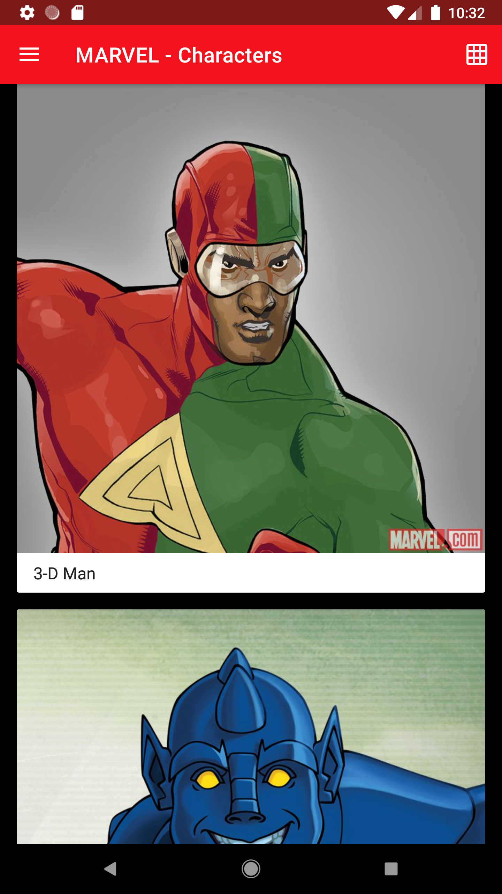
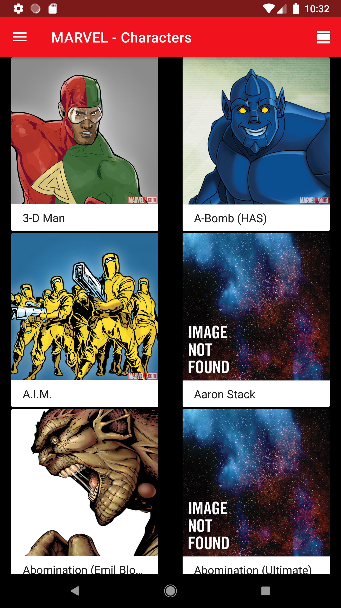
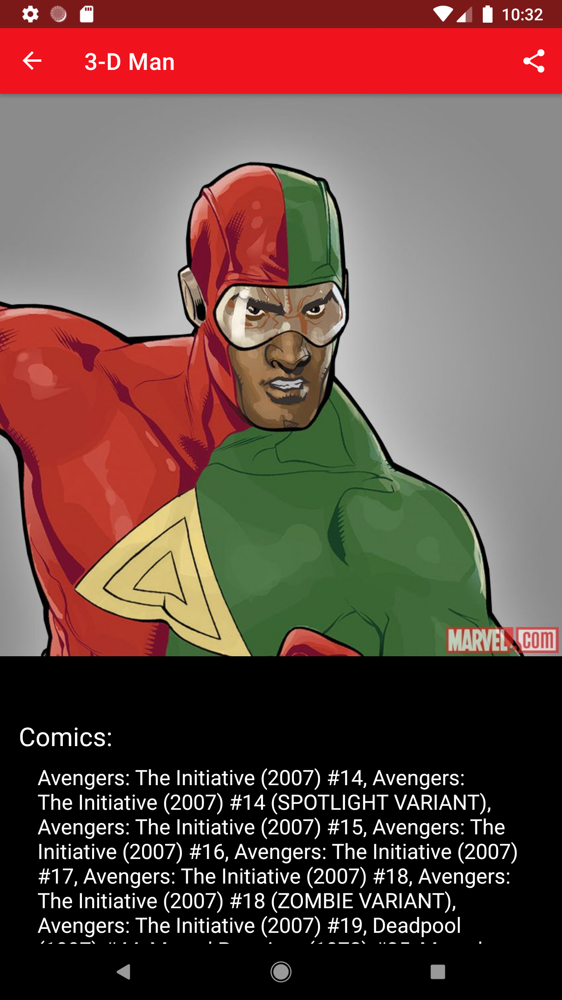

Personajes de Marvel App
=========================

Introduction
------------

La aplicación usa Clean Architecture basada en MVVM y el patron Repository. 

Se ha implementado siguiendo lo recomendado por Google [Guide to app architecture](https://developer.android.com/jetpack/docs/guide).

La aplicacion esta escrita en Kotlin.

- Se usa Android Jetpack.
- Para la ejecucion de peticiones HTTP se usa Retrofit, OkHttp y GSON. Los datos son guardados en una Base de datos usando Room,
el cual sirve como unica fuente de informacion, y ayuda para el soporte del app sin internet.

Paging library es usada para la paginacion online and offline.

Kotlin Coroutines gestionan llamadas.

Navigation component gestiona la navegacion.

Dagger 2 is usada para la injeccion de dependencias.

Glide es usado para cargar imagenes y Timber para el logging.

Se ha usado lottie para la animacion de loading [Ver mas](https://lottiefiles.com/)

Se tiene 2 pantallas: 

1. Lista de Personajes (Con paginación)
2. Detalle de Personaje

Se ha usado Android Studio 4.0

Ademas se ha creado pruebas unitarias y pruebas de UI

Pantallazos
-----------

